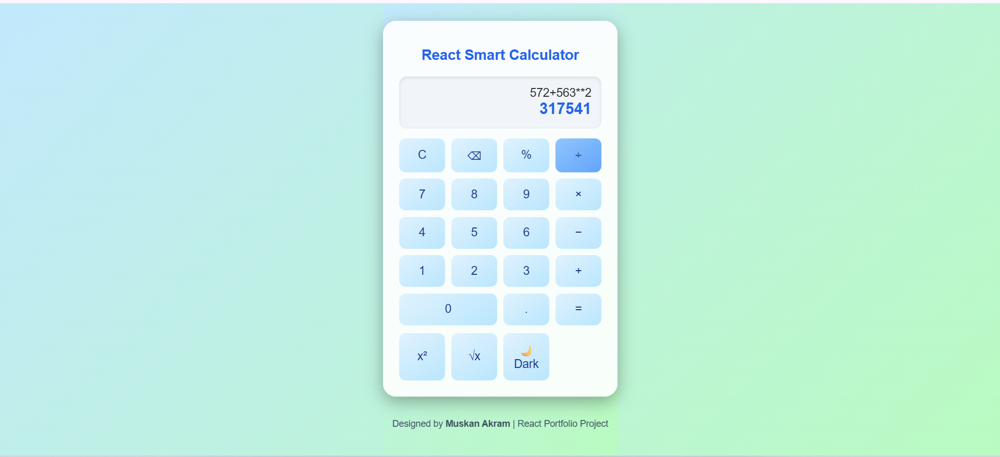
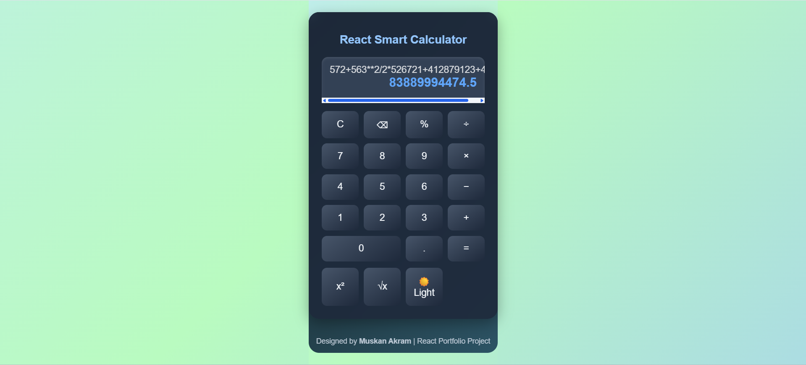

#  React Smart Calculator

A modern and interactive calculator built with **React.js**.  
This project combines clean design, smooth animations, and keyboard support — making it both functional and visually appealing.  
Created by **Muskan Akram** as part of her React portfolio collection.

---

##  Features

-  Basic arithmetic operations (add, subtract, multiply, divide)
-  Extended operations (square, square root, percentage)
-  Full keyboard support (Enter, Backspace, Escape)
-  Dark and light mode toggle
-  Animated gradient background with blur-glass interface
-  Responsive layout for all screen sizes

---

##  Preview

| Light Mode | Dark Mode |
|-------------|-----------|
|  |  |

*(You can add screenshots later by capturing your app and saving them inside a `/screenshots` folder.)*

---

##  Installation and Setup

Follow these steps to run the project locally:

1. **Clone this repository**
   ```bash
   git clone https://github.com/your-username/react-smart-calculator.git
